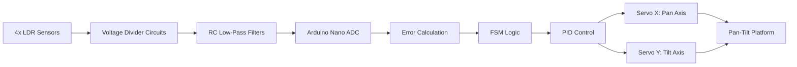
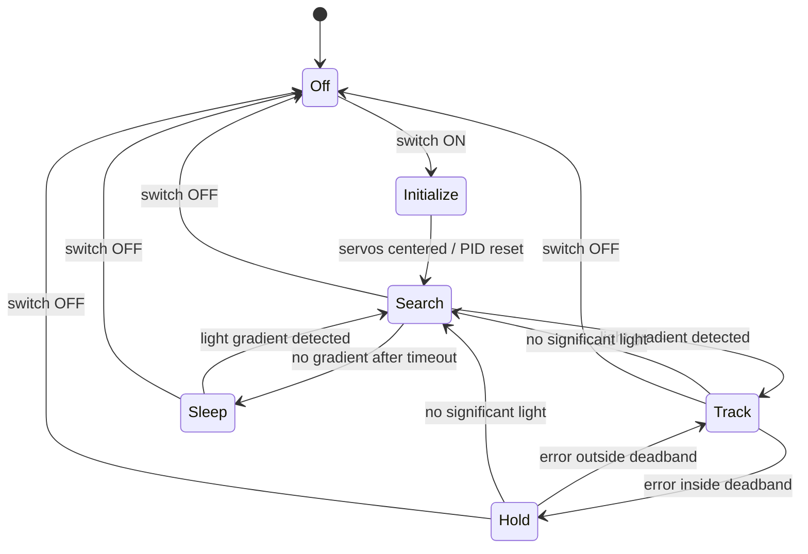

# Two-Axis Embedded Light Tracking System

A two-axis Arduino light tracking platform using four LDR sensors, FSM logic, and PID-based servo control.

This project was built as a personal embedded systems and control project. The system detects the direction of the strongest light source and rotates a pan-tilt platform toward it using two servo motors.


## Demo

[Watch the tracking demo](https://drive.google.com/file/d/1waw5Laf0Yg75xCkR131URpU9xYq5q6HJ/view?usp=sharing)

## Overview

Four light-dependent resistors (LDRs) are arranged in a 2×2 layout to measure light intensity differences across the horizontal and vertical axes. Each LDR is connected as part of a voltage divider, and the filtered analog signals are read by an Arduino Nano.

The Arduino computes horizontal and vertical error signals, runs a finite state machine, and generates servo commands using PID-style control.

The prototype tracks reliably within the central field of view. Testing showed reduced accuracy at larger light angles because the current LDR geometry produces a weaker directional error signal in those conditions.

## Features

- Four-LDR light sensing array
- Voltage-divider sensor front-end
- RC low-pass filtering
- Arduino Nano control
- Two-axis pan/tilt servo actuation
- FSM states: Off, Initialize, Search, Sleep, Track, Hold
- PID-based servo control
- Deadband to reduce jitter
- Servo command limits to prevent mechanical lock-up
- Separate 5 V servo power supply with common ground

## System Architecture



## Hardware

| Component | Purpose |
|---|---|
| Arduino Nano | Reads sensors and runs control logic |
| 4× LDR sensors | Detect light intensity differences |
| Fixed resistors | Form voltage dividers with the LDRs |
| Capacitors | Low-pass filtering and power decoupling |
| 2× servo motors | Pan and tilt actuation |
| External 5 V supply | Powers servos independently |

## Pin Mapping

Final LDR mapping:

```cpp
int TL = analogRead(A6);
int TR = analogRead(A3);
int LL = analogRead(A5);
int LR = analogRead(A4);
```

Final servo mapping:

```cpp
#define servo_x 12   // pan axis
#define servo_y 11   // tilt axis
```

## Control Algorithm

The horizontal error is calculated from the difference between the right and left LDR pairs:

```cpp
float error_x(int TR, int LR, int TL, int LL) {
    int left_side = TL + LL;
    int right_side = TR + LR;
    return float(right_side - left_side);
}
```

The vertical error is calculated from the difference between the top and bottom LDR pairs:

```cpp
float error_y(int TR, int LR, int TL, int LL) {
    int top_side = TL + TR;
    int lower_side = LL + LR;
    return float(top_side - lower_side);
}
```

A positive `x_error` means the right side receives more light than the left side. A positive `y_error` means the top side receives more light than the bottom side. The servo response direction was verified experimentally.

## FSM States

## FSM Diagram



| State | Purpose |
|---|---|
| Off | System disabled |
| Initialize | Centers servos and resets PID variables |
| Search | Checks whether a significant light gradient exists |
| Sleep | Idle state when no useful light gradient is detected |
| Track | Actively follows the strongest light source |
| Hold | Stops small corrections when error is within the deadband |

## Final Tuned Parameters

| Parameter | Value |
|---|---|
| Kp | 0.1 |
| Kd | 0.011 |
| Ki | 1 |
| Tracking threshold | 35 |
| Deadband | 50 |
| Servo minimum pulse | 550 µs |
| Servo maximum pulse | 2450 µs |
| Search timeout | 5 s |

## Testing

The system was tested through:

1. Sensor verification by shining light on each LDR individually
2. Error sign verification for left/right and top/bottom light positions
3. Open-loop servo direction testing
4. Closed-loop tracking with a flashlight
5. Extreme position testing to check servo limits and mechanical lock-up

## Results and Limitations

The prototype achieved stable tracking within the central operating range without sustained oscillation.

At larger light angles, tracking accuracy decreased because the LDR error signal became weaker. Serial debugging showed that the servo commands sometimes remained near the neutral 1500 µs position, meaning the controller was not receiving a strong enough directional error. A taller and more rigid shadow-divider structure would improve full-range tracking.

## Future Improvements

- Improve the LDR mounting and shadow-divider geometry
- Replace breadboard wiring with a custom PCB
- Add over-current protection for the servo power rail
- Integrate a real solar panel and measure generated power
- Add time-based sun position prediction as a feed-forward term
- Add data logging for offline analysis
- Replace LDRs with photodiodes or digital lux sensors
- Add a manual override mode for diagnostics

## Full Report

[Read the full project report](docs/two-axis-light-tracker-report.pdf)

## Built With

- Arduino Nano
- PlatformIO
- C++ / Arduino framework
- KiCad
- diagrams.net / draw.io

## License

This project is released under the MIT License. See [LICENSE](LICENSE) for details.
